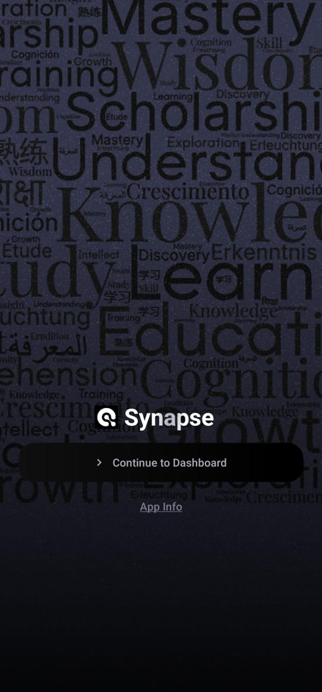
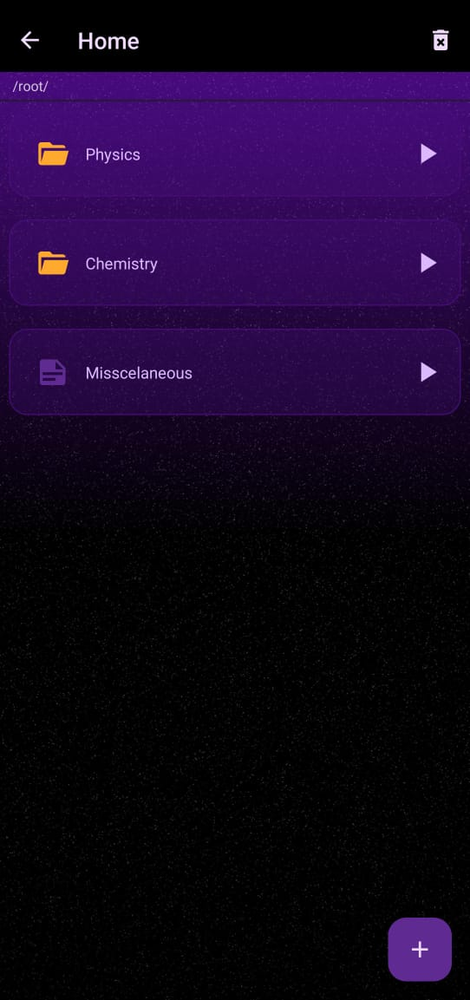
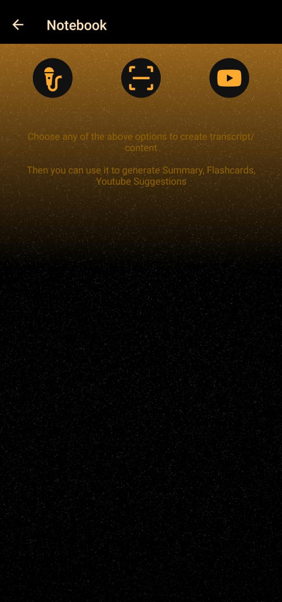
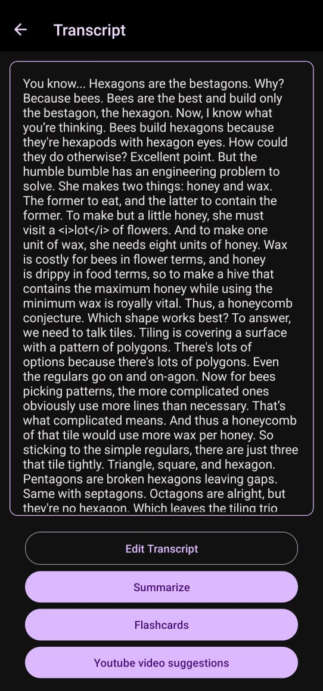
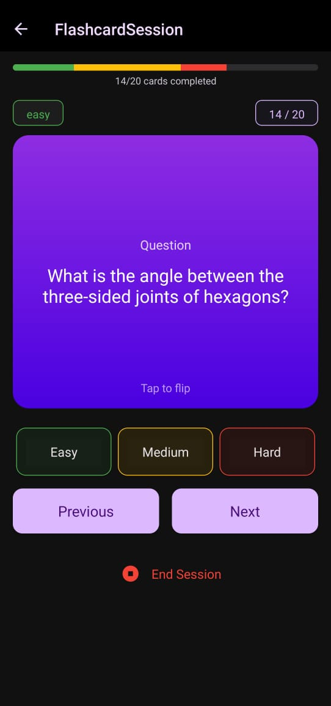
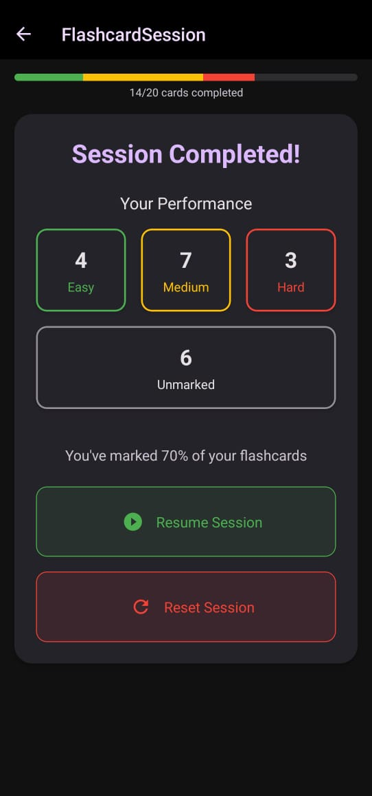

# Synapse 📚

**Synapse** is a comprehensive learning companion app designed to help students capture, understand, and study lecture content efficiently. From lecture recording and transcription to AI-generated flashcards and YouTube video recommendations, Synapse provides all the tools you need to enhance your learning experience.

[Download Synapse (APK)](https://drive.google.com/file/d/your-drive-link-here/view?usp=sharing)

## 🌟 Features

### 📝 Content Capture
- **Lecture Audio Recording & Transcription**: Record lectures and automatically convert speech to text
- **YouTube Video Transcription**: Extract and save transcripts from educational videos
- **Document Scanning (OCR)**: Convert images of textbooks or notes into editable text

### 🧠 AI-Powered Learning Tools
- **Smart Summaries**: Get concise, accurate summaries of your content
- **Auto-generated Flashcards**: Create study cards from key concepts with just one tap
- **Topic-Based Video Recommendations**: Find relevant YouTube videos that explain difficult concepts

### 📊 Study Management
- **Organized Structure**: Create groups and notebooks to keep your content well-organized
- **Flashcard Study Sessions**: Schedule review sessions and track your learning progress
- **Editable Transcripts**: Modify transcripts to correct errors or add personal notes

## 📱 Screenshots

<div style="display: flex; flex-direction: row; flex-wrap: wrap; gap: 10px; justify-content: center;">
    
    
    
    
    
    
</div>

## 🚀 Getting Started

### Installation

1. Clone the repository:
```bash
git clone https://github.com/yourusername/synapse.git
cd synapse
```

2. Install dependencies:
```bash
npm install
```

3. Start the development server:
```bash
npx expo start
```

## 🛠️ Tech Stack

- **Frontend Framework**: React Native with Expo
- **UI Components**: React Native Paper
- **Animations**: React Native Reanimated
- **AI Services**:
  - Google Gemini API for summarization and flashcard generation
  - OCRSpace API for document scanning and text extraction
- **Backend**: Node.js for API handling

## 👥 Team - Asterisk

- **[Pritam Das](https://linkedin.com/in/pritamdas2006)** 
- **[Suparno Saha](https://linkedin.com/in/letsbecool9792)** 
- **[Mohikshit Ghorai](https://linkedin.com/in/mohikshitghorai)** 
