# ✨ Synapse 

**Synapse** is a cutting-edge learning companion designed to streamline the way students capture, understand, and review lecture content. Built as a polished hackathon project, Synapse brings together a suite of powerful features aimed at transforming raw lecture material into actionable study aids—all wrapped in a sleek, user-friendly interface. 

## 🌐 Overview

Synapse helps you get the most out of every lecture by turning spoken words into written content, extracting key insights, and organizing your study materials. Whether you're recording a live lecture, pulling transcripts from educational videos, or scanning textbook pages, Synapse is your all-in-one solution for smarter learning. 

## 🔍 Key Features

- **🎤 Lecture Recording & Transcription**  
  Record lectures seamlessly and convert speech to text for easy review.

- **📺 YouTube Video Transcription**  
  Automatically extract and save transcripts from educational videos to reinforce your understanding.

- **📖 Document Scanning (OCR)**  
  Turn images of textbooks or handwritten notes into editable text with advanced optical character recognition.

- **✨ Smart Summaries**  
  Generate concise, accurate summaries of your lectures and documents to highlight essential points.

- **🎲 Auto-generated Flashcards**  
  Instantly create flashcards from key concepts, making revision quick and effective.

- **🎥 Topic-Based Video Recommendations**  
  Discover curated YouTube content tailored to the subject matter of your study materials.

- **📝 Organized Content Management**  
  Use groups and notebooks to systematically organize all your captured content.

- **✏️ Editable Transcripts**  
  Edit and refine transcriptions to correct errors or add personal notes for enhanced clarity.

## 👨‍💻 Tech Stack

- **Frontend:**  
  - ⚡ **React Native & Expo** – For a smooth, cross-platform mobile experience.
  - 📚 **React Native Paper** – For robust and customizable UI components.
  - 🌟 **React Native Reanimated** – To provide smooth and performant animations.

- **APIs & Services:**  
  - 🤖 **Gemini API** – For advanced AI functionalities.
  - 🔍 **OCRSpace API** – For high-quality optical character recognition.
  - 📲 **Google YouTube Search API** – To fetch and recommend relevant educational videos.

- **Additional Tools & Libraries:**  
  Utilizes modern libraries and tools to ensure efficient performance and seamless user interactions.

## 💾 Installation

1. **💻 Download the APK:**  
   Check the latest release under releases.

2. **👽 Install on Your Device:**  
   Open the APK file on your Android device and follow the on-screen instructions.

3. **⚖️ Permissions:**  
   Grant the required permissions (microphone, camera, storage, etc.) to enable all functionalities.

4. **🌟 Launch & Explore:**  
   Start Synapse, record your lectures, scan documents, and enjoy a smarter learning experience.

## ⚙️ Usage

- **📃 Capture & Transcribe:**  
  Use the recording feature to capture lectures or educational videos, and let Synapse convert them into text.

- **🛠️ Organize Your Content:**  
  Group your recordings, transcripts, and scanned documents into notebooks for easy access and review.

- **✨ Study Smarter:**  
  Utilize AI-generated summaries and flashcards to focus your study sessions and boost retention.

- **🎥 Expand Your Knowledge:**  
  Benefit from topic-based video recommendations to explore additional perspectives on challenging subjects.

## 🏆 Hackathon Journey

Synapse was built as part of the **#TechTrix Software Development @ RCCIIT, Kolkata 2025** hackathon. Our dedicated team—**Pritam Das, Suparno Saha, and Mohikshit Ghorai**—worked tirelessly during an online building period of **36 hours**, followed by a **5-hour offline session** where we pitched our app. The judges provided invaluable feedback, which we quickly incorporated into the project. Our efforts culminated in securing **🏆 1st position** in the hackathon—a milestone that marked our very first hackathon win.

## 🔄 Project Status

This version of Synapse was created as a standalone, polished hackathon entry. It showcases the current functionalities available in our experimental phase. **Note:** Synapse will not be maintained or updated further, serving as a milestone project celebrating our hackathon success.

## 📱 Screenshots

<div style="display: flex; flex-direction: row; flex-wrap: wrap; gap: 10px; justify-content: center;">
    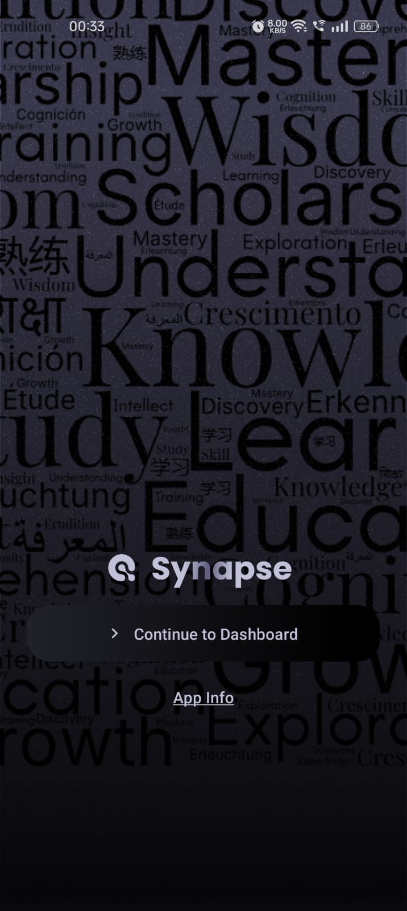
    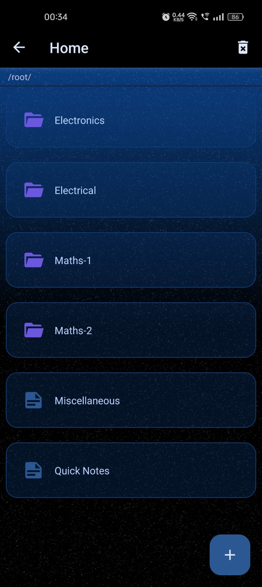
    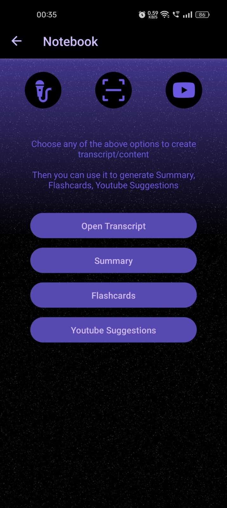
    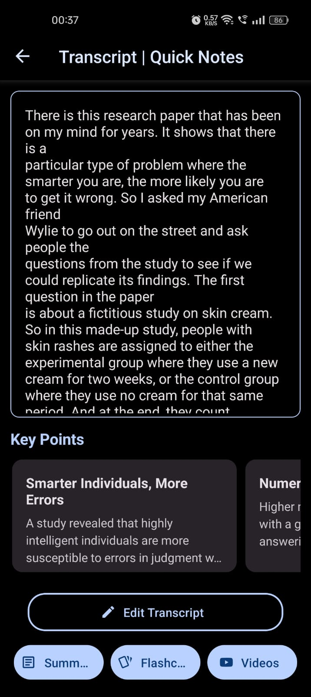
    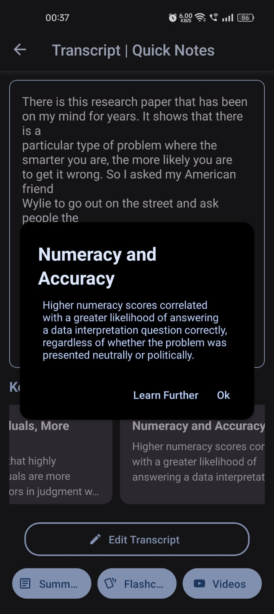
    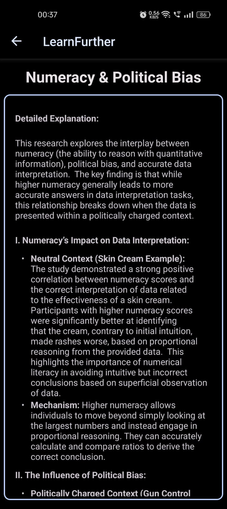
    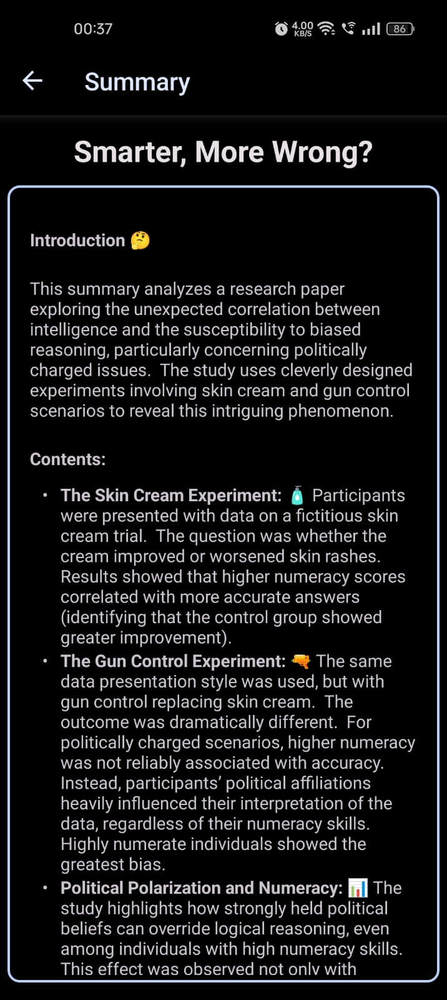
    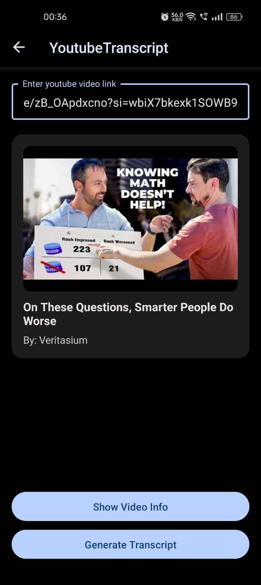
    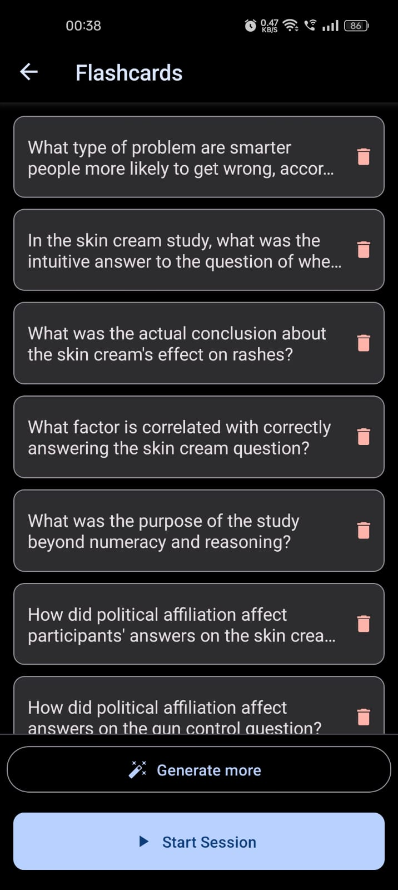
    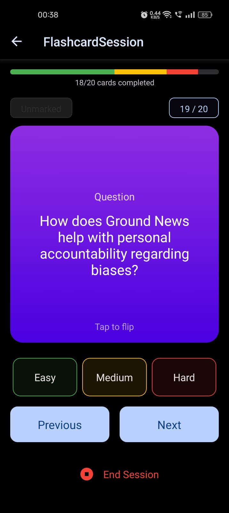
    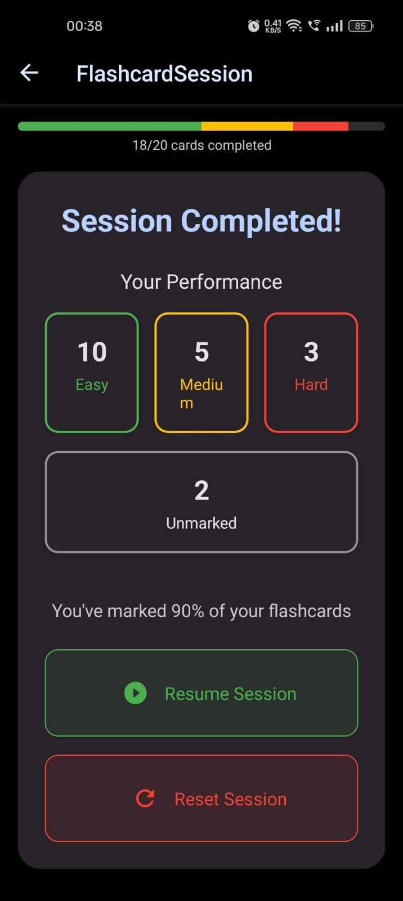
    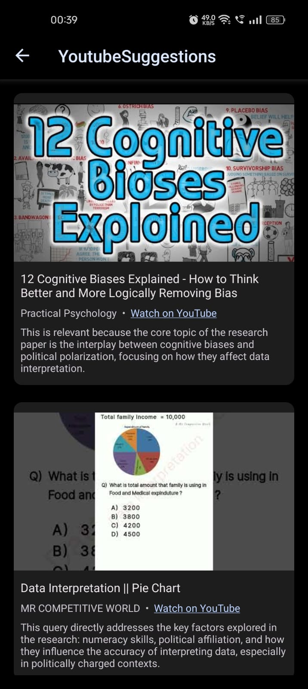
    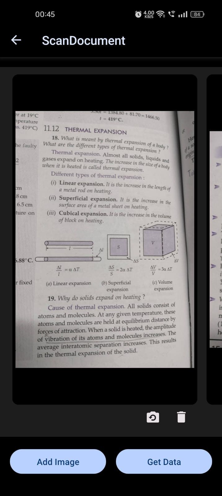
    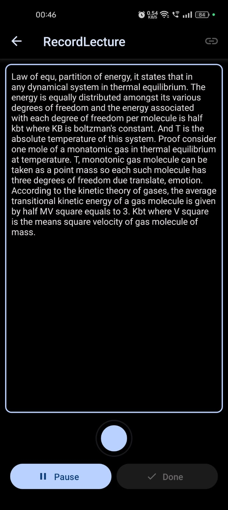
</div>

## 🚀 Getting Started

### Installation

1. Clone the repository:
```bash
git clone https://github.com/psycocodes/synapse/
cd synapse
```

2. Install dependencies:
```bash
npm install
```

3. Start the development server:
```bash
npx expo start
```

## 👨‍💻 Contributing

Contributions are welcome! If you have suggestions or improvements, feel free to fork the repository and submit a pull request. While further development is not planned for this hackathon version, your contributions may help inspire future innovations.

## 📂 License

This project is licensed under the [MIT License](https://mit-license.org/).

## 📚 Acknowledgments

- Special thanks to the **#TechTrix Software Development @ RCCIIT, Kolkata 2025** organizers and judges.
- ✨ A big thank you to the open-source community and the developers behind the libraries and APIs integrated into this project.

## 👥 Team - Asterisk

- **[Pritam Das](https://linkedin.com/in/pritamdas2006)** 
- **[Suparno Saha](https://linkedin.com/in/letsbecool9792)** 
- **[Mohikshit Ghorai](https://linkedin.com/in/mohikshitghorai)** 
